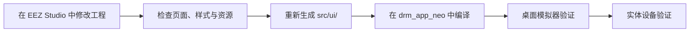

# CRA Electric Pass EEZ Studio 工程

Visual UI Source · Generated LVGL Code

> [!NOTE]
> 本仓库保存 CRA Electric Pass 设备界面的 EEZ Studio 设计工程及其 LVGL 生成代码，当前工程基于 EEZ Studio `v0.25.1`。

  <a href="#目录职责">目录职责</a> ·
  <a href="#为什么独立维护">独立维护原因</a> ·
  <a href="#推荐修改流程">修改流程</a> ·
  <a href="#生成代码边界">生成代码边界</a>

---

## 目录职责

| 路径 | 用途 |
| :--- | :--- |
| `epass.eez-project` | EEZ Studio 的界面工程源文件 |
| `epass.eez-project-ui-state` | 设计器界面状态 |
| `assets/` | 工程引用的图像、字体等设计素材 |
| `src/ui/` | EEZ Studio 导出的 LVGL 界面代码 |
| `font_generate/` | 字符集与字体生成辅助工具 |
| `icon_header_gen/` | 图标头文件生成辅助工具 |

---

## 为什么独立维护

EEZ 工程与生成代码放在独立仓库中，可以保留设计器对象、页面、样式、字体与导出文件之间的对应关系，并使主程序清楚地区分两类内容：

<table>
<tr>
<td width="50%" valign="top">

### 设计与生成

在本仓库修改 `epass.eez-project`，随后由 EEZ Studio 重新生成 `src/ui/`。

</td>
<td width="50%" valign="top">

### 业务实现

在主仓库 `drm_app_neo/src/ui/` 中实现页面动作、设备交互和非生成业务逻辑。

</td>
</tr>
</table>

这样可避免手工修改在下一次 EEZ 导出时丢失，也防止生成文件与工程状态发生漂移。

---

## 推荐修改流程

1. 使用匹配版本的 EEZ Studio 打开 `epass.eez-project`。
2. 在设计工程中修改页面、控件、变量、动作声明与资源。
3. 重新生成 `src/ui/`，并检查 Git 差异是否仅包含预期输出。
4. 在主程序中补齐或调整 `src/ui/` 下的手写业务回调。
5. 先使用桌面模拟器验证页面，再验证实体设备上的 DRM、输入与性能表现。

---

## 生成代码边界

> [!WARNING]
> 不要直接把长期修改写入 `src/ui/` 的生成文件。再次从 EEZ Studio 导出时，这些更改可能被覆盖。

- 视觉布局、页面层级和生成资源：修改 EEZ 工程。
- 设备行为、系统调用和业务状态：修改主仓库的手写 UI 模块。
- 字体或图标字符集：使用对应辅助目录生成，并在 EEZ 工程中同步引用。
- 升级 EEZ Studio 后：先在独立分支或副本中重新导出并审查全部差异。

---

<b>drm_app_neo_eez_design</b> · visual source of the device interface

