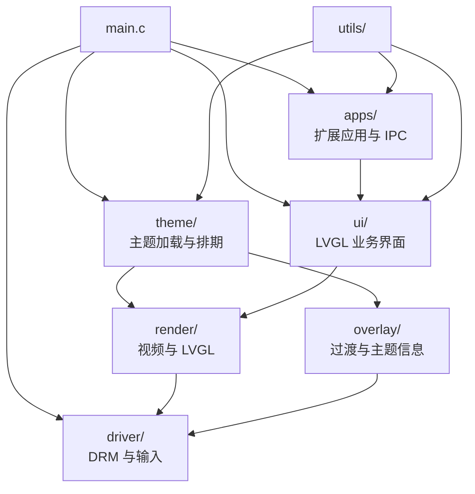

# CRA Electric Pass 设备端源码

Application · Display · Theme · UI

> [!NOTE]
> `src/` 是设备端主程序的手写源码入口，负责应用管理、硬件访问、三层显示、主题调度、业务 UI 与通用基础设施。

  <a href="#模块职责">模块职责</a> ·
  <a href="#运行链路">运行链路</a> ·
  <a href="#顶层文件">顶层文件</a> ·
  <a href="#生成代码边界">生成代码边界</a> ·
  <a href="#修改联动">修改联动</a>

---

## 模块职责

| 目录 | 职责 | 典型入口 |
| :--- | :--- | :--- |
| `apps/` | 扩展应用发现、配置解析、IPC 与生命周期管理 | `apps.c`、`ipc_server.c` |
| `driver/` | DRM Plane、显示队列、私有 IOCTL 与输入设备 | `drm_warpper.c`、`key_enc_evdev.c` |
| `overlay/` | 过渡动画、主题信息和 CRA 自定义叠加绘制 | `overlay.c`、`transitions.c`、`cra_theme_info.c` |
| `render/` | 视频、LVGL、帧缓冲绘制和图层动画 | `mediaplayer.c`、`lvgl_drm_warp.c` |
| `theme/` | `epconfig.json` 解析、主题排期与切换 | `loader.c`、`theme.c` |
| `ui/` | 页面业务回调、设置、文件、主题、休眠与宠物交互 | `actions_*.c`、`scr_transition.c` |
| `utils/` | 日志、缓存、JSON、条码、设置、队列、定时器与 UUID | `cacheassets.c`、`settings.c`、`timer.c` |

---

## 运行链路

显示混叠顺序为 UI、Overlay、Video 自上而下。详细限制参见 [程序结构](../docs/application_structure.md)。

---

## 顶层文件

| 文件 | 用途 |
| :--- | :--- |
| `main.c` | 初始化显示、资源、主题、UI、应用与主生命周期 |
| `config.h` | 设备端路径、资源与功能配置 |
| `cdx_config.h` | CedarX 相关编译配置 |
| `lv_conf.h` | LVGL 编译配置 |

---

## 生成代码边界

EEZ Studio 生成的界面代码位于仓库的 `eez_design/src/ui/`，不在本目录内直接维护。本目录的 `ui/` 保存项目业务回调与扩展逻辑。

> [!WARNING]
> 不要把手写逻辑放入 EEZ 生成文件；再次导出工程时生成目录可能被整体覆盖。

---

## 修改联动

| 修改内容 | 同步检查 |
| :--- | :--- |
| DRM IOCTL 或结构体 | `driver/srgn_drm.h` 与 Buildroot Linux 补丁 |
| 主题字段或枚举 | `theme/`、`overlay/`、`neo-assetmaker` 与兜底主题 |
| 固定资源名或路径 | `config.h`、`utils/cacheassets.*` 与 rootfs `/root/res/` |
| UI 页面、动作或变量 | EEZ 工程、生成代码与 `ui/` 业务实现 |
| 扩展应用协议 | `apps/`、`ui/ipc_helper.*` 与目标应用 |

> [!IMPORTANT]
> 设备端编译成功不等于 DRM 图层、CedarX 解码、输入事件和目标性能已通过实体设备验证。

---

<b>src/</b> · CRA Electric Pass runtime source modules

